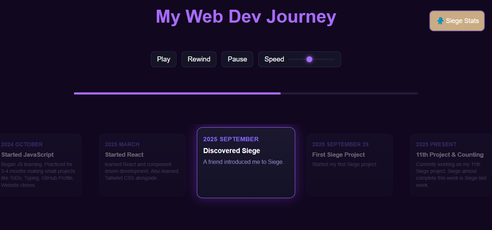
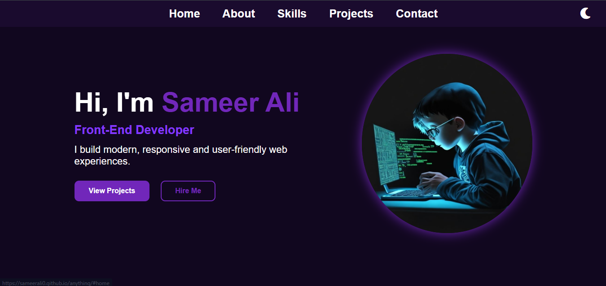
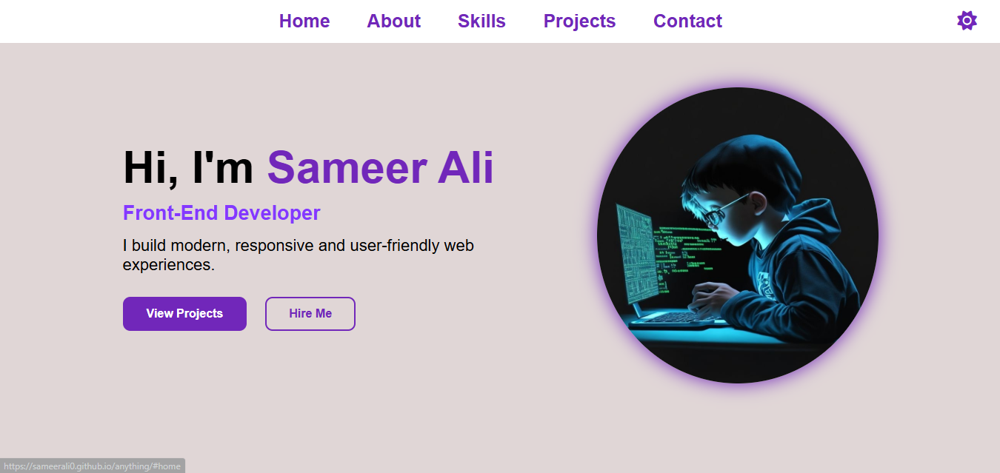

# My Web Dev Journey

This project shows my web development journey i built it using HTML, CSS, and JavaScript. The journey progress moves with play, pause, and rewind buttons, and each card highlights as the progress bar moves i also added a “Siege Stats” button that shows my Siege stats i use Siege API for my siege information and i also add loading page in this project.

## !
During Siege Week 15, I worked on updating my portfolio and creating My Web Dev Journey project.

## screenshot

# Personal Portfolio

This is my personal portfolio website which includes Home section with my introduction and profile image and About section, Skills section showing my skills with progress bars, Projects section with a slider to show my projects and Contact section with contact form and social media links. Also a dark and light theme and a loading page with loading animation.

## Inspiration  
- The color theme and visual style of this portfolio is inspired by a design created in
Figma.  
- Design reference: [Figma design file (link)](https://www.figma.com/community/file/1182197835889504018)

## Built with
- HTML
- CSS
- JavaScript

## Dark theme screenshot

## Light theme screenshot
